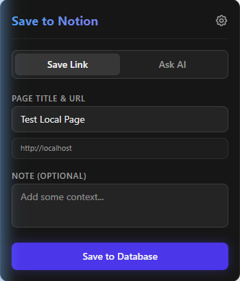

# Save Link to Notion

A Chrome/Brave extension that lets you save links, notes, and chat with AI about the current page directly into your Notion database.

## Features

- **Save Link** – Save the current page URL, title, description, and optional note to a Notion database. Optionally update an existing page if the URL was already saved.
- **Ask AI** – Chat with an AI assistant (via OpenRouter) in the context of the current page. The agent can add images or generated text to the saved Notion page when you ask it to.
- **Settings** – Configure your Notion API key, Database ID, and optional OpenRouter API key and model in the extension options.

## Screenshot



*Popup: Save Link tab with page title, URL, optional note, and Save to Database button.*

## Installation

### From Chrome Web Store (when published)

1. Open the extension page in the [Chrome Web Store](https://chrome.google.com/webstore) (link will be added after publication).
2. Click **Add to Chrome**.

### Manual installation (developer mode)

1. Clone the [repository](https://github.com/Mysttic/save-link-to-notion) and install dependencies:
   ```bash
   npm install
   npm run build
   ```
2. Open `chrome://extensions/` in Chrome or Brave.
3. Enable **Developer mode**.
4. Click **Load unpacked** and select the project **`dist`** folder.

## Development

- **Run in dev mode:** `npm run dev`, then load the `dist` folder in `chrome://extensions/` (refresh after changes).
- **Build:** `npm run build`
- **Package for Chrome Web Store:** `npm run pack` – creates `save-link-to-notion.zip` for upload in the [Chrome Developer Dashboard](https://chrome.google.com/webstore/devconsole).

## Privacy

The extension stores data locally (API keys, Notion database ID) and sends it only to Notion and, optionally, to your chosen AI provider (e.g. OpenRouter). It does not collect or send data to the developers’ servers. See **[PRIVACY.md](PRIVACY.md)** for details.

## License

MIT (see LICENSE file if present).
