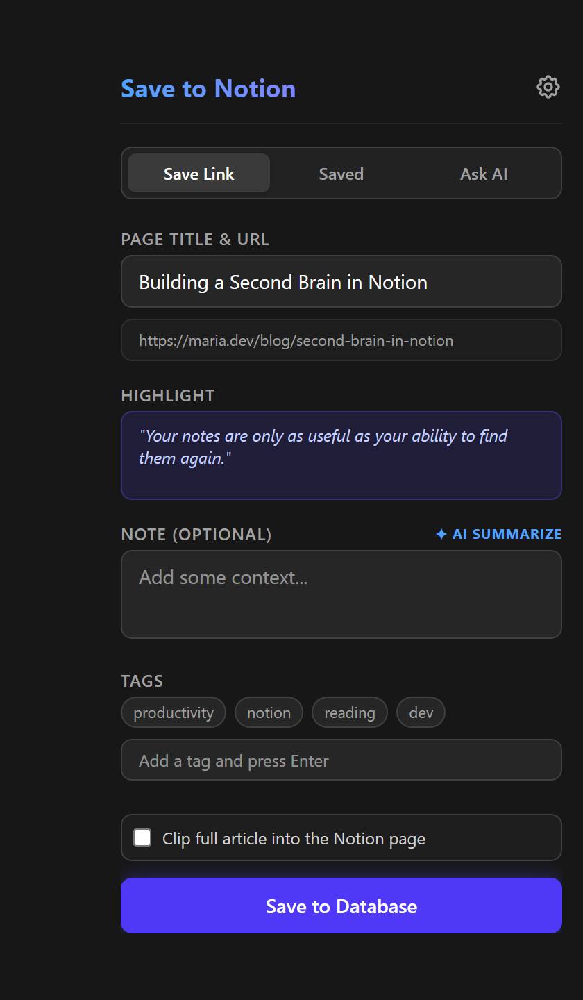
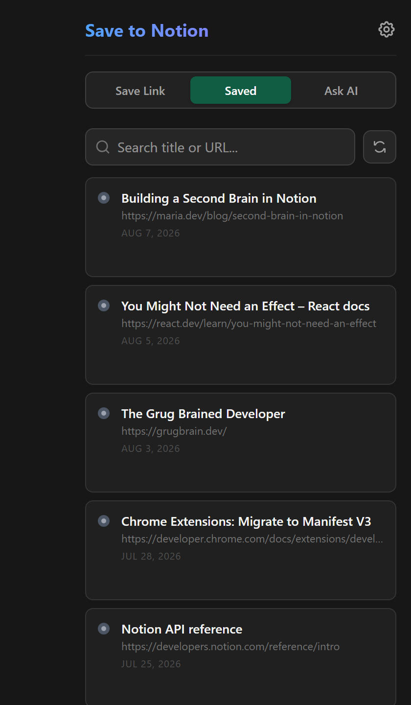
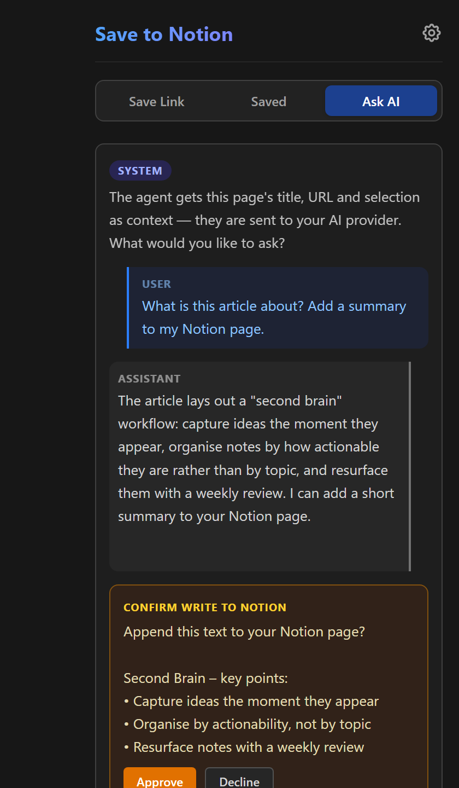

# Save Link to Notion

A Chrome/Brave extension that lets you save links, notes, and chat with AI about the current page directly into your Notion database.

## Features

- **Save Link** – Save the current page URL, title, description, tags, selected text and an optional note to a Notion database. Re-saving a known URL updates the existing row instead of duplicating it.
- **Clip full article** – Optionally append the readable body of the page to the Notion page as real blocks (headings, paragraphs, lists, quotes, code and images).
- **Tags** – Pick from the multi-select options that already exist in your database, or type new ones.
- **AI summarize** – Fill the note and suggest tags from the page content with one click.
- **Ask AI** – Chat with an AI assistant (via OpenRouter) in the context of the current page. It can add images or generated text to the saved Notion page, but every write is confirmed by you first.
- **Saved** – Browse, search (server-side, across the whole database) and reopen everything you saved.
- **Quick save** – Right-click menu (page, link or selection) and a keyboard shortcut save without opening the popup.
- **Offline queue** – Saves that fail because Notion is unreachable are retried automatically in the background.
- **Settings** – Configure your Notion API key and Database ID, test the connection, or create a ready-made database in one click. OpenRouter key and model are optional.

## Keyboard shortcuts

| Shortcut | Action |
|---|---|
| `Ctrl+Shift+S` (`Cmd+Shift+S`) | Open the popup |
| `Ctrl+Shift+D` (`Cmd+Shift+D`) | Save the current page without opening the popup |

Both can be remapped at `chrome://extensions/shortcuts`.

## Permissions

| Permission | Why |
|---|---|
| `activeTab` + `scripting` | Read title, description and selection from the tab you are on, only after you invoke the extension |
| `storage` | Keep your API keys, settings and the offline queue on this device |
| `alarms` | Retry queued saves in the background |
| `contextMenus` | The right-click "Save to Notion" entries |
| `favicon` | Show site icons in the Saved list from the browser's own cache, with no third-party requests |
| `https://api.notion.com/*` | Talk to the Notion API |
| `https://openrouter.ai/*` | Talk to your AI provider (only when you use AI features) |

The extension has no access to pages you do not explicitly act on, and injects no content scripts.

## Screenshots

| Save Link | Saved | Ask AI |
|---|---|---|
|  |  |  |

*Screenshots are generated from the built extension with sample data:
`npm run build && node scripts/screenshots/capture.mjs`. The `-1280x800`
variants in [docs/screenshots](docs/screenshots) are sized for the Chrome Web
Store listing.*

## Installation

### From Chrome Web Store (when published)

1. Open the extension page in the [Chrome Web Store](https://chrome.google.com/webstore) (link will be added after publication).
2. Click **Add to Chrome**.

### Manual installation (developer mode)

1. Clone the [repository](https://github.com/Mysttic/save-link-to-notion) and install dependencies:
   ```bash
   npm install
   npm run build
   ```
2. Open `chrome://extensions/` in Chrome or Brave.
3. Enable **Developer mode**.
4. Click **Load unpacked** and select the project **`dist`** folder.

## Development

- **Run in dev mode:** `npm run dev`, then load the `dist` folder in `chrome://extensions/` (refresh after changes).
- **Build:** `npm run build`
- **Lint:** `npm run lint`
- **Unit tests:** `src/*.test.ts` are written for Vitest, but no runner is wired up yet — there is no `test` script and Vitest is not a dependency, so nothing executes them.
- **Smoke test:** `npm run smoke` – drives the built service worker in `dist/` against a fake Notion API. Run `npm run build` first.
- **Package for Chrome Web Store:** `npm run pack` – creates `save-link-to-notion.zip` for upload in the [Chrome Developer Dashboard](https://chrome.google.com/webstore/devconsole).

## Releases

Changes are listed in **[CHANGELOG.md](CHANGELOG.md)**.

The current version is marked in **[VERSION.md](VERSION.md)**. It has to agree
with `public/manifest.json`, `package.json` and the newest `CHANGELOG.md`
section. `npm run release:check` verifies all four, and the release workflow
refuses to publish otherwise — a release whose notes describe a different
version is worse than no release.

Releasing:

1. On `develop`, bump the version in `public/manifest.json`, `package.json` and
   `VERSION.md`, and add a `## [x.y.z] - YYYY-MM-DD` section to `CHANGELOG.md`.
2. Open a pull request into `master`. The **CI** workflow checks the release
   metadata from step 1 (all four files agree and the version is not tagged yet)
   and runs lint, types, the build and the smoke test on it. It starts only for
   pull requests whose source branch is `develop` — nothing else is verified
   here.
3. Merge. The **Release** workflow validates the metadata, packs the extension,
   tags `vX.Y.Z` and publishes a GitHub release with
   `save-link-to-notion-vX.Y.Z.zip` attached and the changelog section as the
   release notes. It can also be started by hand from the Actions tab.
4. Upload the zip from the release in the
   [Chrome Developer Dashboard](https://chrome.google.com/webstore/devconsole).
   The submission answers are in [docs/store-listing.md](docs/store-listing.md).

A version that is already tagged is caught on the pull request, where CI fails
before the merge. After the merge the release workflow checks again before
anything is installed or built, and skips the release rather than overwriting
it. A deliberate re-release is still possible by starting the workflow by hand
with **force**, which replaces the existing release and its tag.

## Notion Setup

### 1. Create a Notion Integration

1. Go to [https://www.notion.so/profile/integrations](https://www.notion.so/profile/integrations) and click **New integration**.
2. Give it a name (e.g. *Save Link to Notio*), select your workspace, and click **Save**.
3. Copy the **Internal Integration Token** (starts with `ntn_...`) — this is your **Notion API Key**.

### 2. Share your database with the integration

1. Open your Notion database page.
2. Click the **⋯** menu (top right) → **Connections** → find your integration and click **Connect**.

> Without this step the extension will get a `403 Unauthorized` error.

### 3. Find the Database ID

The Database ID is the part of the URL between the last `/` and the `?`:

```
https://www.notion.so/yourworkspace/317c38xxxxxxxxxxxxxxxxxxxxxxxx?v=...
                                    ↑ this is the Database ID (32 chars)
```

Paste this ID into the extension's **Options** page.

---

### 4. Database structure

**The fastest route:** on the Options page, paste your API key and click *"or create a new database…"*. Pick a page the integration can access and the extension creates a database with the right schema and selects it for you.

To use an existing database instead, the extension reads its schema and maps columns automatically — names do **not** have to match, so Notion's default `Name` title column works fine.

| Role | Detected as | Required | Description |
|---|---|:---:|---|
| Title | the database's title column, any name | ✅ | Page title |
| Link | a URL column named `Link`, otherwise the first URL column | ☐ | Page URL — also used to detect if a page was already saved |
| Description | a text column named `Description`, otherwise the first text column | ☐ | Your note and the page meta description |
| Tags | a multi-select column named `Tags`, otherwise the first multi-select | ☐ | Tags you pick plus the page's `og:type` |
| Highlights | a text column named `Highlights` | ☐ | Text you selected on the page |
| Session ID | a text column named `Session ID` | ☐ | Internal identifier (optional, can be hidden) |

> Columns that do not exist are skipped instead of failing the save. Without a URL column the extension cannot tell whether a page was already saved, so it will always create a new row.

Use **Test connection** on the Options page to see exactly which column got mapped to which role.

---

## Privacy

The extension stores data locally (API keys, Notion database ID) and sends it only to Notion and, optionally, to your chosen AI provider (e.g. OpenRouter). It does not collect or send data to the developers’ servers. See **[PRIVACY.md](PRIVACY.md)** for details.

## License

MIT (see LICENSE file if present).
